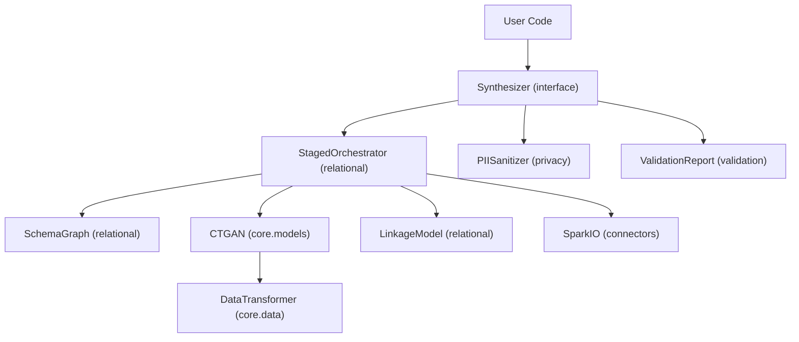

# Architecture

SynthoHive is organized into six modular packages, each handling a distinct concern in the synthetic data pipeline.

## Package Overview

- **interface**: `Synthesizer` facade, `Metadata`, `TableConfig`, `PrivacyConfig` entry points. [See API](api/interface.md).
- **core**: `DataTransformer` for normalization/encoding, and `CTGAN` (Conditional WGAN-GP) for deep generative modeling. [See API](api/core.md).
- **relational**: `StagedOrchestrator` managing the generation DAG, `SchemaGraph` for dependency analysis, and `LinkageModel` for parent-child cardinality learning. [See API](api/relational.md).
- **privacy**: `PIISanitizer` with regex-based detection, and `ContextualFaker` for locale-aware obfuscation. [See API](api/privacy.md).
- **validation**: `ValidationReport` and `StatisticalValidator` measuring KS/TVD metrics. [See API](api/validation.md).
- **connectors**: `SparkIO` for scalable I/O and `RelationalSampler` for stratified data sampling. [See API](api/connectors.md).

## Module Interaction

## Key Flows

1. **Fit**: The `Synthesizer` delegates to `StagedOrchestrator`, which uses `SchemaGraph` to determine topological order. For each table, `DataTransformer` profiles columns, `CTGAN` trains (optionally conditioned on parent context), and `LinkageModel` learns child counts.
2. **Sample**: Generators produce rows in topological order. `LinkageModel` drives child counts, and referential integrity is enforced via FK assignment. Secondary FKs are populated by random sampling from already-generated parent tables.
3. **Privacy**: `PIISanitizer` detects and masks/fakes PII **before** training. `ContextualFaker` injects locale-aware replacements based on row context (country, region).
4. **Validation**: `StatisticalValidator` computes KS test (numeric), TVD (categorical), and correlation distance (Frobenius norm). `ValidationReport` generates HTML or JSON reports.

## Design Principles

- **Per-table models**: Each table gets its own CTGAN instance rather than one monolithic model. This scales linearly and allows independent tuning.
- **Conditional generation**: Child tables are trained on data joined with parent context columns, so generated children reflect realistic parent-child correlations.
- **Pluggable models**: The `ConditionalGenerativeModel` abstract base class allows swapping in custom model implementations via the `model_cls` parameter.
- **Privacy before training**: PII sanitization occurs upstream of model training, ensuring no raw PII enters the generative model.

See [Data Flow](data-flow.md) for a stepwise diagram and [Guides](guides/fitting.md) for hands-on steps.
