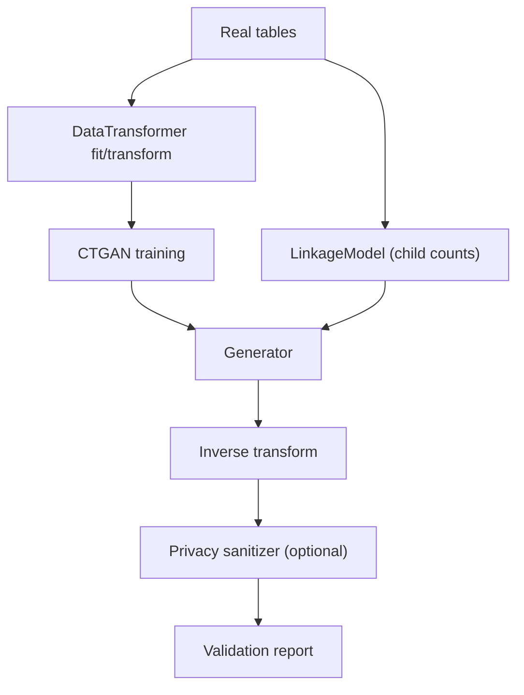

# Data Flow

## Steps
1. **Transform**: `DataTransformer.fit/transform` profiles each column (continuous via VGM, categorical via OHE or embeddings) and excludes PK/FK where configured.
2. **Train**: `CTGAN.fit` learns distributions; conditional context from parent tables can be merged before fitting.
3. **Linkage**: `LinkageModel.fit` learns child-row cardinalities from FK counts.
4. **Sample**: `CTGAN.sample` generates rows; linkage drives child counts; FKs are assigned to maintain integrity.
5. **Inverse**: transformer rebuilds the original schema; constraints (clip/round) are applied.
6. **Privacy**: `PIISanitizer` masks/hashes/fakes PII; `ContextualFaker` injects locale-aware values.
7. **Validate**: `ValidationReport` compares distributions (KS/TVD), correlations, and provides previews.
