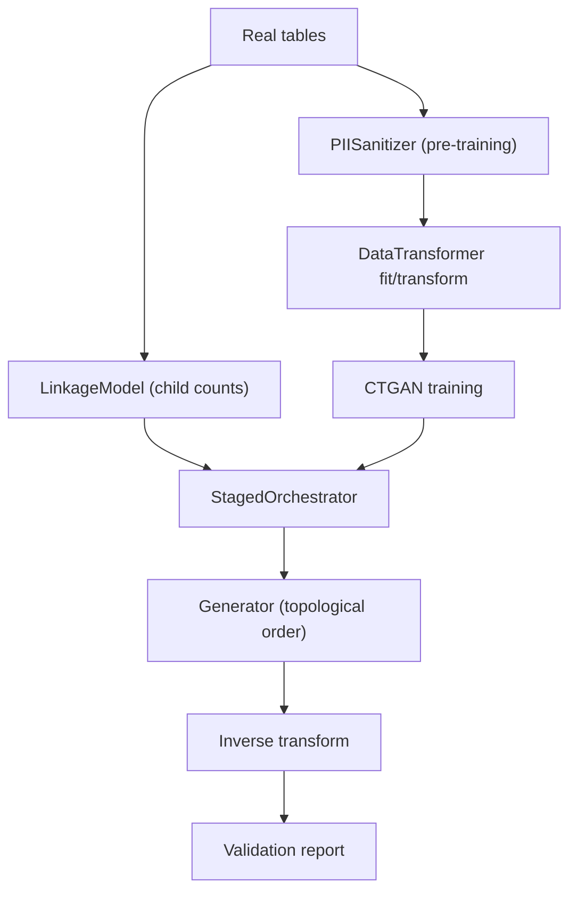

# Data Flow

```mermaid
flowchart TD
    A["Real tables"] --> P["PIISanitizer (pre-training)"]
    P --> B["DataTransformer fit/transform"]
    A --> D["LinkageModel (child counts)"]
    B --> C["CTGAN training"]
    D --> E["StagedOrchestrator"]
    C --> E
    E --> F["Generator (topological order)"]
    F --> G["Inverse transform"]
    G --> H["Validation report"]
```

## Steps

1. **Privacy (Pre-Training)**: `PIISanitizer` detects and masks/fakes PII columns **before** any model training occurs. This ensures no raw sensitive data enters the generative model.
2. **Transform**: `DataTransformer.fit/transform` profiles each column (continuous via VGM, categorical via OHE or embeddings) and excludes PK/FK where configured.
3. **Linkage**: `LinkageModel.fit` learns child-row cardinalities from FK counts in the real data.
4. **Train**: `CTGAN.fit` learns distributions; conditional context from parent tables is merged before fitting child models.
5. **Orchestrate**: `StagedOrchestrator` uses `SchemaGraph` to determine topological order (parents before children) and coordinates the multi-table generation pipeline.
6. **Sample**: `CTGAN.sample` generates rows per table. Linkage models drive child counts. FKs are assigned to maintain referential integrity. Secondary FKs are randomly sampled from already-generated parent tables.
7. **Inverse**: `DataTransformer.inverse_transform` rebuilds the original schema; constraints (clip/round) are applied.
8. **Validate**: `ValidationReport` compares distributions (KS/TVD), correlations (Frobenius norm), and provides data previews in HTML or JSON format.
