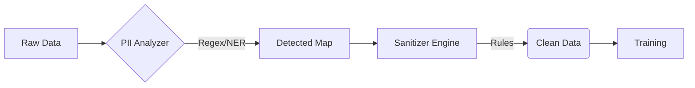

# Privacy Guardrails

Synthetic data is only useful if it effectively masks sensitive information while retaining utility. SynthoHive applies privacy controls **before** any finding or training occurs, ensuring that no raw PII ever enters the generative models.

## The Sanitize workflow



## Detection Strategies

We use a combination of heuristics to detect Personal Identifiable Information (PII):

1.  **Column Naming**: Checks for keywords like "email", "ssn", "phone", "address".
2.  **Pattern Matching**: Scans a sample of data against a library of regular expressions (Email, IPv4, Credit Cards, Social Security Numbers).
3.  **Thresholding**: A column is flagged only if $> 50\%$ of non-null values match a pattern.

## Sanitization Actions

Once PII is detected (or manually configured), you can apply one of several actions:

| Action | Description | Use Case |
| :--- | :--- | :--- |
| **`drop`** | Removes the column entirely. | High-risk fields with zero utility (e.g., internal system IDs). |
| **`mask`** | Replaces all but the last 4 characters with `*`. | Credit cards, phone numbers where visual format matters. |
| **`hash`** | Replaces value with SHA-256 hash. | Maintaining distinctness for joining without revealing value (e.g., User IDs). |
| **`fake`** | Replaces with realistic fake data. | Names, Addresses, Emails that need to look "real" for the model. |

## Context-Aware Faking

Standard fakers generate random data. **Contextual Faking** ensures consistency.

Example: If a record has `Country="US"`, the sanitizer will generate a US-formatted phone number, not a UK one. This preserves the statistical structure of the data even in faked columns.

## Configuration

You can customize rules via the `PrivacyConfig` object:

```python
from syntho_hive.interface.config import PrivacyConfig
from syntho_hive.privacy.sanitizer import PiiRule

config = PrivacyConfig(rules=[
    PiiRule(name="custom_code", patterns=[r"^[A-Z]{2}-\d{4}$"], action="mask")
])
```
