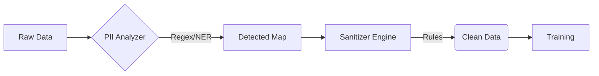

# Privacy Guardrails

Synthetic data is only useful if it effectively masks sensitive information while retaining utility. SynthoHive applies privacy controls **before** any finding or training occurs, ensuring that no raw PII ever enters the generative models.

## The Sanitize workflow



## Faker vs. Embeddings

It is important to distinguish when to use **Faker** versus **Embeddings**:

*   **Faker (Sanitization)**: Used when you need to **hide** the original values and replace them with plausible dummies. This creates *new* values (names, emails) that never existed in your real dataset. Use this for PII.
*   **Embeddings (Modeling)**: Used when you want the model to **learn associations** between high-cardinality categories (e.g., "ZipCode" correllated with "Income"). The generative model uses embeddings to capture these patterns but typically reproduces values from the *existing vocabulary* of the training data.

> [!TIP]
> Use **Faker** for privacy (hiding identity). Use **Embeddings** for utility (preserving statistical relationships in categories like Brands, Cities, or Diagnosis Codes).

## Detection Strategies

We use a combination of heuristics to detect Personal Identifiable Information (PII):

1.  **Column Naming**: Checks for keywords like "email", "ssn", "phone", "address".
2.  **Pattern Matching**: Scans a sample of data against a library of regular expressions (Email, IPv4, Credit Cards, Social Security Numbers).
3.  **Thresholding**: A column is flagged only if > 50% of non-null values match a pattern.

## Sanitization Actions

Once PII is detected (or manually configured), you can apply one of several actions:

| Action | Description | Use Case |
| :--- | :--- | :--- |
| **`drop`** | Removes the column entirely. | High-risk fields with zero utility (e.g., internal system IDs). |
| **`mask`** | Replaces all but the last 4 characters with `*`. | Credit cards, phone numbers where visual format matters. |
| **`hash`** | Replaces value with SHA-256 hash. | Maintaining distinctness for joining without revealing value (e.g., User IDs). |
| **`fake`** | Replaces with realistic fake data. | Names, Addresses, Emails that need to look "real" for the model. |
| **`keep`** | Retains the original value. | Low-sensitivity fields or when data is already sanitized source. |
| **`custom`** | Uses a user-provided function. | complex logic requiring row-level context. |

## Context-Aware Faking

Standard fakers generate random data. **Contextual Faking** ensures consistency across columns.

### How it works

The `ContextualFaker` looks for specific keys in the row data to determine the locale for generation:
*   `country`
*   `locale`
*   `region`

Example: If a record has `Country="US"`, the sanitizer will generate a US-formatted phone number (e.g., `+1-555...`). If `Country="JP"`, it generates a Japanese number.

Supported locales include: `US`, `UK`/`GB`, `JP`, `DE`, `FR`, `CN`, `IN`.

### Internal Mechanism

Internally, `ContextualFaker` leverages the **`faker`** python library. It optimizes performance by maintaining a **cache of Faker instances** initiated for each required locale (e.g., `ja_JP` for Japan, `de_DE` for Germany).

1.  **Locale Resolution**: It scans the row for the context keys.
2.  **Instance Selection**: It maps the value (e.g., "JP") to a specific `Faker` locale identifier (e.g., `ja_JP`) using an internal `LOCALE_MAP`.
3.  **Generation**: It delegates the generation to that specific locale's provider. For example, `fake.phone_number()` for `ja_JP` produces a valid Japanese format compliant with local regex rules.

If no context is found, it falls back to a default `en_US` generator.

## Configuration

You can customize rules via the `PrivacyConfig` object:

```python
from syntho_hive.interface.config import PrivacyConfig
from syntho_hive.privacy.sanitizer import PiiRule

config = PrivacyConfig(rules=[
    PiiRule(name="custom_code", patterns=[r"^[A-Z]{2}-\d{4}$"], action="mask"),
    PiiRule(name="audit_id", patterns=[r"^AUD-\d+"], action="keep")
])
```

## Custom Logic

For complex scenarios, you can define a custom generator function that receives the entire row context. This is useful for conditional sanitization or format-preserving encryption.

```python
def redact_sensitive_id(row: dict) -> str:
    # Example: Redact differently based on user role from another column
    if row.get('role') == 'admin':
        return row['user_id'] # Keep visible for admins (in this hypothetical flow)
    return f"REDACTED-{hash(row['user_id']) % 1000}"

config = PrivacyConfig(rules=[
    PiiRule(
        name="custom_logic", 
        patterns=[r"user_\d+"], 
        action="custom", 
        custom_generator=redact_sensitive_id
    )
])
```
